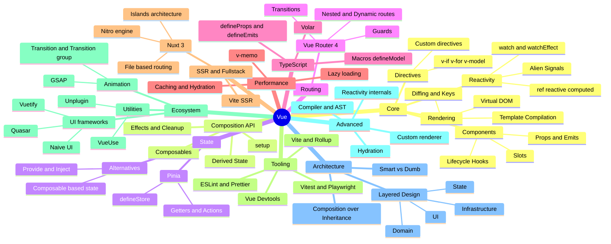

# All you need is (Love) Vue


---




---
layout: two-cols
heading: About me
---

<template v-slot:default>
<div class="flex flex-col justify-center items-center h-full">
  
  <h2 class="mt-4">Alexander Opalic</h2>
</div>
</template>

<template v-slot:right>
<VClicks class="space-y-2 mt-10 text-xl h-full">

* Developer at Otto Payments  
* 7 years with Vue  
* Based near Munich, Germany  
* Blogger at alexop.dev  
* Talks on Vue, testing, GraphQL, AI

</VClicks>
</template>

---
layout: center
---

#  Why Vue Exists

---

# Evan You & The Birth of Vue

<VClicks class="space-y-2 text-xl">

- **Background**: Art history major, MFA in Design & Technology from Parsons
- **2012**: Joined Google Creative Labs prototyping browser experiments
- **The Problem**: Angular had great data binding but too much complexity
- **The Idea**: "What if I extract just the parts I like and make it lightweight?"
- **2013**: Started Vue as a personal experiment in his free time
- **Feb 2014**: Released Vue.js publicly — a framework by a designer, for developers

</VClicks>

---

# 11 Years of Growth: The Vue Ecosystem

<VClicks class="space-y-2 text-xl">

- **Vue Router**: Official routing solution, evolved alongside the core
- **State Management**: Vuex (2016) → Pinia (2022, now official)
- **Nuxt**: Meta-framework for SSR, SSG, and full-stack apps (2016+)
- **Vite**: Next-gen build tool created by Evan You (2020)
- **Official DevTools**: Browser extensions for debugging Vue apps

</VClicks>

---

<div class="flex justify-center items-center h-full">
  <iframe
    src="https://platform.twitter.com/embed/Tweet.html?id=590281695581982720&theme=dark"
    width="550"
    height="200"
    frameborder="0"
    scrolling="no"
    class="rounded-lg"
  ></iframe>
</div>

---

````md magic-move
```html
<!DOCTYPE html>
<html lang="en">
  <head>
    <meta charset="UTF-8" />
    <meta name="viewport" content="width=device-width, initial-scale=1.0" />
    <title>Counter Button</title>
  </head>
  <body>
    <button id="btn">Count: 0</button>
  </body>
</html>
```

```html
<!DOCTYPE html>
<html lang="en">
  <head>
    <meta charset="UTF-8" />
    <meta name="viewport" content="width=device-width, initial-scale=1.0" />
    <title>Counter Button</title>
  </head>
  <body>
    <button id="btn">Count: 0</button>

    <script>
      let count = 0;
      const btn = document.getElementById('btn');
    </script>
  </body>
</html>
```

```html
<!DOCTYPE html>
<html lang="en">
  <head>
    <meta charset="UTF-8" />
    <meta name="viewport" content="width=device-width, initial-scale=1.0" />
    <title>Counter Button</title>
  </head>
  <body>
    <button id="btn">Count: 0</button>

    <script>
      let count = 0;
      const btn = document.getElementById('btn');
      btn.addEventListener('click', () => {
        count++;
        btn.textContent = `Count: ${count}`;
      });
    </script>
  </body>
</html>
```
````


---

# The mental picture

When data changes, the UI should *react* automatically.  
No manual updates. No `document.querySelector()` acrobatics.  


---

# Vue to the rescue

````md magic-move
```vue
<template>
  <button>Count: 0</button>
</template>
```

```vue
<script setup>
</script>

<template>
  <button>Count: 0</button>
</template>
```

```vue
<script setup>
import { ref } from 'vue'
const count = ref(0)
</script>

<template>
  <button>Count: {{ count }}</button>
</template>
```

```vue
<script setup>
import { ref } from 'vue'
const count = ref(0)
</script>

<template>
  <button @click="count++">Count: {{ count }}</button>
</template>
```
````

<VClicks class="space-y-2 mt-4">

- Data lives inside `ref()`
- Template shows data directly
- Vue updates automatically when it changes

</VClicks>


---
layout: two-cols
heading: Single File Components
---

<template v-slot:default>

````md magic-move
```vue
<template>
  <div>Hello World</div>
</template>
```

```vue
<script setup>
import { ref } from 'vue'
const message = ref('Hello World')
</script>

<template>
  <div>{{ message }}</div>
</template>
```

```vue
<script setup>
import { ref } from 'vue'
const message = ref('Hello World')
</script>

<template>
  <div>{{ message }}</div>
</template>

<style scoped>
div {
  color: #ff6bed;
}
</style>
```
````

</template>

<template v-slot:right>
<div class="grid gap-6 mt-4">

<div v-click="0">
  <div class="text-2xl font-bold mb-2"><code>&lt;template&gt;</code></div>
  <div class="text-lg">Your HTML structure</div>
</div>

<div v-click="1">
  <div class="text-2xl font-bold mb-2"><code>&lt;script setup&gt;</code></div>
  <div class="text-lg">Your JavaScript logic</div>
</div>

<div v-click="2">
  <div class="text-2xl font-bold mb-2"><code>&lt;style&gt;</code></div>
  <div class="text-lg">Your CSS (optional)</div>
</div>

<div v-click="3" class="mt-4 text-xl opacity-80">
  Each <code>.vue</code> file = one component
</div>

</div>
</template>

---


<VuePlayground
height="460px"
url="https://play.vuejs.org/#eNp9kU1PAjEQhv/KpBc0EDDRE1mMSjjoQY167AXLgIVu27RTJNnsf3faldUD4daZ9yNPM4249368TyimoooqaE8QkZK/lVbX3gWCBgKuoYV1cDUM2DqQVjkbCZRLlmCW9YurS2mrSdfAWR4Ia2+WhDwBVJ+JyFm4U0ar3UyKkh0OpSgywDzPU2ia39a2LbFJl2NTNekLxUhQZIS13oy30Vlmb7I7t9ZeGwwvnjQjSsGNXb8US2Pc91PZUUg4Ou7VF6rdif02HvJOiteAEcMepeg1WoYNUicv3p/xwO9erN0qGXafEd8wOpMyY2d7SHbF2P98hfaxXEDbzUdcHAhtPH4qg2ZnW/xS8FXmZ77+h3s9vik5aVvR/gBvjaiO"
/>

---
layout: center
---


# Lets build our own Ref 

---
layout: two-cols
heading: Building our own Ref
---

<template v-slot:default>

````md magic-move
```js
const effects = new Set()
```

```js
const effects = new Set()

function effect(fn) {
  effects.add(fn)
  fn()
}
```

```js
const effects = new Set()

function effect(fn) {
  effects.add(fn)
  fn()
}

function ref(value) {
  return {
    get value() { return value },
    set value(v) {
      value = v
      effects.forEach(fn => fn())
    }
  }
}
```

```js
// usage
const count = ref(0)
effect(() => {
  console.log('render', count.value)
})
count.value++
```
````

</template>

<template v-slot:right>
<div class="grid gap-6 mt-8 text-lg">

<div v-click="0">
  <div class="text-2xl font-bold mb-2">Store effects</div>
  <div>Create a Set to track all functions that need to re-run when data changes</div>
</div>

<div v-click="1">
  <div class="text-2xl font-bold mb-2">Register effects</div>
  <div>The <code>effect</code> function adds a callback to the Set and runs it immediately</div>
</div>

<div v-click="2">
  <div class="text-2xl font-bold mb-2">Create reactive refs</div>
  <div>The <code>ref</code> function wraps a value with getter/setter. When the value changes, all effects re-run</div>
</div>

<div v-click="3">
  <div class="text-2xl font-bold mb-2">Use it!</div>
  <div>Create a reactive counter, register an effect, and watch it automatically update when count changes</div>
</div>

</div>
</template>

---
layout: center
---

# The Real Deal: Vue's Reactivity

---

<div class="text-center mb-8">
  <div class="text-3xl font-bold mb-4">Core Mental Model</div>
  <div class="text-2xl text-pink-400">"Reads <span class="text-white">track</span>, Writes <span class="text-white">trigger</span>"</div>
</div>

<div class="grid gap-8 mt-12 text-xl">

<div v-click="0">
  <div class="text-2xl font-bold mb-3">📖 When you READ</div>
  <div class="pl-4">
    Vue registers the current effect as a dependency for that value
  </div>
  <div class="pl-4 mt-2 opacity-70">
    <code>count.value</code> → "Effect A depends on count"
  </div>
</div>

<div v-click="1">
  <div class="text-2xl font-bold mb-3">✍️ When you WRITE</div>
  <div class="pl-4">
    Vue schedules all dependent effects to re-run
  </div>
  <div class="pl-4 mt-2 opacity-70">
    <code>count.value++</code> → Re-run Effect A (not B, C, D...)
  </div>
</div>


</div>

---

# watchEffect

```ts
import { ref, watchEffect } from 'vue'

const count = ref<number>(0)

watchEffect(() => {
  console.log(`Count changed: ${count.value}`)
})
```

---

<VuePlayground
height="460px"
url="https://play.vuejs.org/#eNp9Ustu2zAQ/JUFUSAOYksJ2l5c2Wib+pAe2qLtkYco1EpiQpEEH44NQf/eFWW7PgQ+CCB3Zpazo+3ZF2uzbUS2ZIUXTtoAHkO0oErdrDgLnrM117KzxgXowWE9h9cyiHZT1ygCDFA708EV9bjimmthtA8gTNQBViO90LF7Qree3V6P+Jl2NruG1Rp6roEE2huFmTLN7PE+qUVLFrBawrs+tcu2pYo4PFKbgb4in/ySO7oE7KwqA9INoKjkNh3o2N6tz+2m1uhgsytJgEVO+IFp1wlcQt8f/A9Dkdsj/BRDMBo+CyXFCyWTKDc3FM+DFg471KHIJ9JFyWJBkm/4lqTIJ+NFfjYOXX3YKwQvjMWKKkSaQqsNtavLTqr9Evzek2oR5Rx8qf3Co5P1p5Fmy6qSulnCHb1JlYHrg7PUpStdI/XCyaal4W+zjycWRTy+TE+yOW0C/aNaNtmzN5rWJWnHmTorFbqfNkj6h5xRftP4nJVKmdfvqRZcxPmxLloUL2/Un/1urHH2yyHZ3yJnJyyQSwwTvPnzA3d0PoGdqaIi9gXwN9J+xdHjRPsadUW2z3jJ7UNadErrr9/sAmp/HGo0OjKHxOeM9v3+wuj/7b7PPiQdJcqGf6vkKf4="
/>

---

 # Components

 <div class="flex justify-center items-center h-full">
  <Excalidraw
    drawFilePath="./example.excalidraw.json"
    class="w-[600px]"
    :darkMode="true"
    :background="false"
  />
</div>

---

# Local brains

<VClicks class="space-y-2 text-xl">

- Its a function with its own scope 
- Each component has its own state (`ref`s)  
- Each controls its own part of the DOM  
- Composition gives clarity  

</VClicks>

---

<VuePlayground
height="460px"
url="https://play.vuejs.org/#eNp9UcFOAjEU/JXaCxrYXRM9kYWohIMe1KjHXrA8sNBtm/YVSTb777bdBYmSvXXezDTz3tT03ph854GOaXmRZaSDJMumTJWOW2GQOEBvAhaV0RbJTHuFYMnK6ooM8qLD0TcIpqJ1BX0ACJWRC4SACCkPzuI/LIujlI4oOq7VSqzzjdMqZKujnlGuKyMk2BeDQivH6JgkJnILKfX3U5qh9TA6zPkX8O2Z+cbt44zRVwsO7A4YPXK4sGvAlp6/P8M+vI9kpZdeBnUP+QZOSx8ztrIHr5Yh9okupX1M9xRq/eHmewTlDkvFoFHZJD2j4bKzntV/497kt8nHVBOueFJM7Pd8mzWxsCJN12bbYTi+Q8KjnUwif3l91d/sp0fUitxxKfh2EpsK3uGQ0WkKEcLW3X9NUxat+k/rzQ+u4trn"
/>

---

<VuePlayground
height="460px"
url="https://play.vuejs.org/#eNqdU01v2zAM/SuELnGQIG62nQwn6Fbk0B22YutRF9ehE7W2ZOgjC2D4v4+SbC9th27oTeLjox6px459btvVySHLWG5KLVoLBq1roS7kYcOZNZxtuRRNq7SFDjRW0EOlVQMzos0m6EY5aVEP0Cod7r42JXFZKmksWGWLGja+TLK+mnugcrK0Qkk4FnJf460sNTYobXIqaocZSNc8oJ5DxyVE/iogsNhAOHDZc5mnUT1ppYvFpq0Li3QDyI8ftvfh3dJrgiRILOrhjtrMM+i6QVvf5ykRfBmijl1lxhba0jyuOINrMWqkwAvVBKfx1VfU9X9y8/RCPlvSF9DsKnFYPRol6Z/CIDgrVdOKGvX31k+Pvoma8IjHqDn162uIWe1wOcbLI5ZPf4k/mrOPcXan0aA+IWcTRuoPSNo8vPv5Dc90nsBG7V1N2W+AP9Co2nmNMe2L803ri7yg9jbYSMjDvdmdLUozNuWF+sw+5HNGhrp5o/U/cj+uPgUe+YOmeOHH93t9tHEH4VMJ3cAeKyHxTqvW5EFFgEbf0uPbJPg8MrERdiLt6DKQEnL6bPLGbBmtPbk/g5MS+5fFop/jNoVXny/UVC4Ztifkx+1ZLHzAq0mePbumEv9YpwdnLVW/LmtRPtHYJnqYnv+FMOuwU1FhTxWJmEbmK4v3vwHp241e"
/>

---

# Composables: Reusable Logic

<VClicks class="space-y-2 text-xl">

- Functions that use Vue's reactivity system
- Extract and reuse logic across components
- Convention: start with `use` (like `useCounter`, `useMouse`)
- Return reactive state and functions to components

</VClicks>

---
layout: two-cols
heading: Building a Composable
---

<template v-slot:default>

````md magic-move
```vue
<script setup>
import { ref } from 'vue'
const count = ref(0)
const increment = () => count.value++
</script>

<template>
  <button @click="increment">
    Count: {{ count }}
  </button>
</template>
```

```ts
// composables/useCounter.js
import { ref } from 'vue'

export function useCounter() {
  const count = ref(0)
  const increment = () => count.value++

  return { count, increment }
}
```

```vue
<script setup>
import { useCounter } from './composables/useCounter'

const { count, increment } = useCounter()
</script>

<template>
  <button @click="increment">
    Count: {{ count }}
  </button>
</template>
```
````

</template>

<template v-slot:right>
<div class="grid gap-6 mt-8 text-lg">

<div v-click="0">
  <div class="text-2xl font-bold mb-2">Start with component logic</div>
  <div>A simple counter component with its own state and logic</div>
</div>

<div v-click="1">
  <div class="text-2xl font-bold mb-2">Extract to a composable</div>
  <div>Move the logic into a reusable function. It's just a function that uses Vue's reactivity!</div>
</div>

<div v-click="2">
  <div class="text-2xl font-bold mb-2">Use it in any component</div>
  <div>Import and destructure the returned values. The logic is now reusable across your entire app</div>
</div>

</div>
</template>

---


# The Essentials You'll Use Daily

---

# Template syntax

<VClicks class="space-y-2 text-xl">

- `{{ value }}` — text binding  
- `@click="fn"` — event  
- `:class="isOn ? 'on' : 'off'"` — dynamic binding  
- `v-for="todo in todos" :key="todo.id"` — loops  
- `v-if` / `v-show` — conditions  
- `v-model="form.name"` — two-way binding  

</VClicks>

---

<VuePlayground
height="480px"
url="https://play.vuejs.org/#eNqNVM1u2zAMfhXGF69A42DrTl7a/aHFNgzNsBbbYdpBtWlHrSwZkuw2MPLuo+TEUYui2E0iP/Lj/5B8bNus7zDJk6UtjGgdWHRdC5Kr+pQlzrLkjCnRtNo4GMBgBVuojG4gJbOUKaYKrayDBq3lNcKpx7xKv6CUGn51OEuP9hBhV2qnr7i0OCnsWt+fPzjDn9U6XWq70/xhCigMUebw+hgcPrgc0u/IjfJcKWyPD4A3E+C3EQ6h0OUTxMmEuEZerEG7NRpLGKb+Ev0hgLqWPrNXR3B6BoN34HPJei47L58dfkyR8XIx1pIqRx+HTSu5Q/oBLEvRhwc9Z/N54IcboUqhapjP96r2bBimkm63y0UbfE1m2KNyEf6mc04r+FBIUdz5voWQqXfkJpT9PeXYUZVWVZWCTzh8FOVKzkfrxwzlRvFGFM/ERhlAXkhuLRHtnWtyRW41uQ8T45EAV467zuYQRbG6DMDVxYXn3rlcjFWJ6KXWrY1IOzk5XUoB/bzSJuRZahBqnBGWQH6Hm504E2UUCbV8CKgsVHzP7Lml2JMsAksUBfW/FE7QFMS9IXZREcs0tsQzjq9QlYZeWHFD83Iv3DpAx+5Ntt7sv6096lH3n3Y63p1Z7PN6nNrwjVp8qPZyEU0mfa3bEN4WusWSJBmxDFQBqU0OUjT4zu9FRh0+iGvDN0FME++tySw5pqNBdatEnd1areiyhIVhSaGbVkg0qzZUlCU0F2NSLOF0Le6/BZkzHYYdDTZrLO6ekd/aBy9jyQ+DFk1Poz7pHDc1ulF9fnVJ7Y6UjS47vxgvKH+i1bLzMY6wT50qKewIF6L9Gm4irca1pRqjsvukfKAeOV4altCd/PxC6odwT7K3wY5uSLL9B7XKzZU="
/>

---
layout: two-cols
heading: Computed and watch
---

<template v-slot:default>

````md magic-move
```ts
import { ref } from 'vue'

const price = ref(10)
const qty = ref(3)
```

```ts
import { ref, computed } from 'vue'

const price = ref(10)
const qty = ref(3)

const total = computed(() => price.value * qty.value)
```

```ts
import { ref, computed, watch } from 'vue'

const price = ref(10)
const qty = ref(3)

const total = computed(() => price.value * qty.value)

watch(total, (t) => {
  console.log('total changed:', t)
})
```
````

</template>

<template v-slot:right>
<div class="grid gap-6 mt-8 text-lg">

<div v-click="0">
  <div class="text-2xl font-bold mb-2">Start with reactive values</div>
  <div>Create refs for price and quantity - these will be the source of our derived data</div>
</div>

<div v-click="1">
  <div class="text-2xl font-bold mb-2">Add computed property</div>
  <div>The <code>computed</code> function creates a derived value that automatically updates and caches its result</div>
</div>

<div v-click="2">
  <div class="text-2xl font-bold mb-2">Watch for changes</div>
  <div>The <code>watch</code> function lets you react to changes with side effects like logging or API calls</div>
</div>

</div>
</template>

---
layout: two-cols
heading: v-model - Two-way binding
---

<template v-slot:default>

````md magic-move
```vue
<template>
  <input :value="message">
</template>
```

```vue
<template>
  <input
    :value="message"
    @input="message = $event.target.value"
  >
</template>
```

```vue
<template>
  <input v-model="message">
</template>
```
````

</template>

<template v-slot:right>
<div class="grid gap-6 mt-8 text-lg">

<div v-click="0">
  <div class="text-2xl font-bold mb-2">One-way binding</div>
  <div>With <code>:value</code>, data flows from component to input only. User typing doesn't update the ref</div>
</div>

<div v-click="1">
  <div class="text-2xl font-bold mb-2">Manual two-way binding</div>
  <div>Add <code>@input</code> to update the ref when user types. Now data flows both ways, but it's verbose</div>
</div>

<div v-click="2">
  <div class="text-2xl font-bold mb-2">v-model shortcut</div>
  <div><code>v-model</code> is syntactic sugar that combines <code>:value</code> and <code>@input</code> automatically</div>
</div>

</div>
</template>

---


<VuePlayground
height="480px"
url="https://play.vuejs.org/#eNp9U01vEzEQ/Ssjc0grNR+o4bKklQBVohwAARfEcnDs2Y2L17Zsb7pRtP+dsTebLhLtzZ735nnmzfjI3jm32LfICrYJwisXIWBs3W1pVOOsj3AEjxX0UHnbwIyos9KURlgTIhjeINwkwsVsdjlGee1xDFdcByRksxzUSZcuERuneUS6AWyk2oPQPISbklXWNyXLcUKUcW2E/byxEjWh6b2SAeUK3Fkt0VPwp219roSQ5Zip+Rb16XIWigeHlCB2KP5sbUf8J+lc9EQB4H5o5CS4nCpu3O1H1NrC8Th40PdwkdmySLHBgb6/3CyTkymdmqTTZjlpna4hHjRCENahpMgitQ/HlCFVIN6hgEpj9zZF0mEulUcRlTUFCKvbxmSo5q6A1eKNxybfG97NH5WMuwKuVyuX8nsaaDLh18mEiF0s2e/hMcelVKb+R2NrPflbwGvXQbBaSXglhJhAc8+lakMB6/GBbNFz5XOtajNX1D+lCDQR/bT29fAuqdCqJFfIDnbFInljKlUvHoI1tKRZnEZoG6c0+i8ueRFKRrYPo6FJ0mAeP+VY9C1ejfE89v/EHwJtQkGHrx4D+j1twRmL3NdIPiX47vvn7NkZpNVpNbFfAL8hWdemGgfa+9ZIKnvCy9Xe569GE/gR7rqIJoxNpUITs8/8ktH3+/BC60/lXi/WOY8cZf1fLbhLtA=="
/>

---


# Create a project


- Use **Create Vue** (official tool)  
- Powered by **Vite**  
- TypeScript optional  


```bash
npm create vue@latest
npm install
npm run dev
```

---

# Or just one file

````md magic-move
```html
<!doctype html>
<html>
  <head>
    <script src="https://unpkg.com/vue@3/dist/vue.global.prod.js"></script>
  </head>
  <body>
    <div id="app"></div>
  </body>
</html>
```

```html
<!doctype html>
<html>
  <head>
    <script src="https://unpkg.com/vue@3/dist/vue.global.prod.js"></script>
  </head>
  <body>
    <div id="app">
      <button @click="count++">Count: {{ count }}</button>
    </div>
  </body>
</html>
```

```html
<!doctype html>
<html>
  <head>
    <script src="https://unpkg.com/vue@3/dist/vue.global.prod.js"></script>
  </head>
  <body>
    <div id="app">
      <button @click="count++">Count: {{ count }}</button>
    </div>

    <script>
      const { createApp, ref } = Vue
      createApp({
        setup() {
          const count = ref(0)
          return { count }
        }
      }).mount('#app')
    </script>
  </body>
</html>
```
````

---


# Next Steps

<VClicks class="space-y-2 text-xl mt-6">

- **Read the docs** — [vuejs.org](https://vuejs.org) has excellent guides and examples
- **Build your own projects** — Practice is the best teacher
- **Learn about testing** — Vitest + Vue Test Utils make testing enjoyable
- **Explore VueUse** — Collection of composable utilities ([vueuse.org](https://vueuse.org))
- **Try a UI library** — Nuxt UI, PrimeVue, or Vuetify for ready-made components
- **Have fun!** — Experiment, break things, and enjoy the journey

</VClicks>

---

# What we learned

<VClicks class="space-y-2 text-xl">

- Data lives in refs
- Templates react to data changes
- Effects re-run automatically
- Components isolate logic and state

</VClicks>

---

<VuePlayground
height="480px"
url="https://play.vuejs.org/#eNqtWt1yE8kVfpVGUCupyhrZhiVE2F4IOLWQClALRS4sV3kstaSB0cxUz0i2InSbB8jFPkwqT8OT5Dunf6Z7JBt7K0XtLtN9+vR3/k8f7br1siii5UK2Bq2jcqSSohKlrBaFSONsejxsVeWwdTLMknmRq0qshZITsRETlc9FG8faz93e57dlnn1O5JVUZj/qe2t0CVEPs1GelZX4gp3XcRWLY7EeZkJk8VwOxLD19uP7d0IfGbb2aGcpVZnk2UAcRPu8MJFxtVCyHIizYWuUp2lclMllKkEPBuUqq+JrMUumsxT/VEk21RuZLCs5FvnlFzkisc6ZGaQlEjBjGELI6yLOxi/TdCAmcVpKphKimkkNkJkaaELM4+vXsqhmQLdPKxtel9fxvEg1QiZbi2pV8PGyUgbRMk4XvPSrTNNc/CNX6XjYMhz8I9lifsnasEeeHO6guszzVMaZR1aphRQbotOixotqlisnqNX4a7mUaV44fQsBC1XxqHKUEGgeJ1DIsDWWyxdGumiUz90RIa7kZZlUzHFWVUU56PcDQk3HcPCvjecKaT4t4QZwraO1KGJSptbSc2MMOR4II57YnJ2fdM7OuzivT1uSDzho2ejjNeUwmyyyUQUvEjMQp/JTPp2msgPJMxLzx7d2tS4IasTqjRZZOUsmleZBl0CqrXtODadX+JzKDl0Dp7DwDNNAAs0dcjCtZnvU16GJQMRHJaHUuJL4EuJonCzFKI3LEsEaFwVHKyn6aHZw4sWSONW2OOpjndgwjRef1oyDMYISvGx8WsMJ8aJipWHP16G3b+XojVhaRxgqwR7o1zBmhyeWRostOmmylF2APbTiFEo6OWmzh8CFsOu1ICkjrdJksuoE2twT2SJN98RhV2w2R30w2XGryBVcntOIJAv71y7S+tYcYWvWsZMmYtmb5Ao7HWztiQS3XnfxH/YSRPLgq1xhl9e9kzgLtHk2JfAgjUhkhmeWa8Lv//q3MERWLPGLaNu/t8VAtC1yfG04uviGfppYEfqLVLtKH76Cvx31PQ/CZ1mtUinKEVLAGCsRvAgRMUEO6E3ieZKu4LArpM55b5HsiTLOSuheJZPnsNV4DK0PxKGS8+cU1pE1jfbsy3j0daryRYZQerg/OfjTYQyPpgSTUiJ6KA/ls8k+LzleB8SLD+dqLFVPxeNkgaB5Wlzzco56MEnzqwHls5yXkIR7M0l5GVAO95mQweRTjSMQZp5neVnEI6lv8SFO9unP/fDsurxG2cOFBqcOZFI2tNzaQ2lFApsk04hCDfWXkVJBmxdJKtX7gvII/MilYQQ4CsXVW16j5G5yL87M5OjrjvUvJRyPMvIHlEupllQi7V4VqymFEG2ffnwnr+uiNmzN8/GCYvuWzd9kmacLwqjJ/gIVArZHx2jfcHcATX4qT68rmVEpd0DrijlsoT94dYvoNdzH0RNbRKDFRotx1z6mUPkyGcs9Khd7Is/+Dg+g7uCW3uZdPpZhZ0Mrtq9xnMmaGs/f5Mrxi/rBut8JyXlSId+P5STJ5Ck+yiOWuoNa2tY5t70Hf1yleQwnvUuxGohlnozZEZlLIzP77Fwtcmc2Jx1dMzU8aKqguqrxfaAvjY8KBZw7W/E9rm36xQHxefX74pNCqDm4IoPyymYRJ43aIv5RVqaQn5x0MnklsNDpNso5Ka9RZG1VxU5nh+QvlYpXEVnFlQq+VRde5s+VnBCz8kXMWCHpWNuKKz6gOxDaSMSFK7xVqgGSTGCE7ZuiWVwyedfQ1Y2ATzWWqaw0X4KmmzGSzHmGdog9zxG4b4UbMP1GSPq65Qpkuvvx142lYW913bSCp8dXlJ5ID0aTSemYeVpMkCD0YqjF2rFZBoWwVjD8bRr17obDUqCLlx/ewE5iNEvSsZLYMxmgE8QlpKU7rpJqlmR1ZvHSam1r/qxBm8bfPR44bkzZxoL49k3bBdBcSFC0o2FIqiRORZmhjM/yapi5dNSBMx+f1P68S8f0r7s2iCRrb2keV7Y/qJPbgNUIOgptamBImfhsqzyv2rwAoaSqVj16PGAHOZ/TAj1cqKG7e5fhQblHje7ZzmHyM/25W6V+clPn0KzIQVK/ayWher2AragBpJflj6vJH6gRNyZh89SzWTgoDbxgDPYO9kJm1jviG9pielM2MvQbFoCeuvwERNXXyGihiBE1wSvff8nrFRNrCkC1Lu4YXPU7u46ugTC+r/uDOs7sRn2o+WIPIiwrMSqABLGVCzbISBIkoQW6ZgMnFIxS9oNtuaImdJO5q5nKrwSVqFOlctVp1yE1X0BDlzK4Kg5mJQ5R209bmAnAbpSx0PUwcnrni3yiLW51zx+faOfYOaKfNEgQXfCSkv/b0WnJ1DqbTNsx7ZHD6SMekTg+PuZHVE1MX5rWrBA0IPNO2cQUpn8SQzN1FSDG3EZ09EyG3mEMpGvFs1Znqt0SGghnbc0D9coIcx4l2ShdoDp0nJaM3OKnn3yw4oER8WbU22UrBAjj3gpvhy/55Y6xcOWiMrGD2Ll4APGvuZrDrwuVoDbg4aWVWyKVKjFOSmTflQWKJZAC3GczXrjJW+5q+l20rhrUB9xSfWrbW/hwW+emtjt7MWw9WntUm2Hrwve6j0wfOHRTO3bYx70buwUmAiagEiUQdCrZrS+7dbOiHvjOaR3LeuM5A71LBJq+zBz09qJ5XHQ6mKjN3WgB13fcSM7P7ANN4WZxpirwYUfPpeHCqpQ+N9GjNR/cXJjpHLe/zZ7RYHvPuoyMZgIxNNYzzDvM8BGjrVvAEl0A9UcgcWALom9qPG+plaD06MYh1vZ9bfe6kmrSP2bYtnbj+xv2QpMEDh2lMptCwK5261DpGi0EJx80qqevpr/7d6xZU2VUpslIdvb3xONu9CVPsg5lxe7G7OpbxYl4TLOkKIp4jNTebAwMX7HmBcTpj3MQPd+3Xj6sLtqxby/SzS4tGtl2JDj/CVVnQwfIwHmJvq2ncyHdUTfXSM16nrCzdSY4tyVVqgf/V7j37slJwdRf28W1aLt1IzBSKCK6rjdIh7aDf9Dridc6f7lI4/E+SU4P1uukRBLs9ewBtNYZppfJBFf5ocmV0O/pA5DwHj1xDY5sNgOICoaGuYfpVx7/+pWeH/223vtpueuhs7qyCH3T+BNYliJAqM0C3C9GCIGv1K2HDhqMYSGJp0/Ewvff/8ux8P33/4TDVE88K+DO+01yuQcAr4GjGqhbF8JyxkjWPo6G4VyeIktps+jUxqNkH/FNApCNnPw2gW7bpjaNcd2GXbY9xb2yg6m3PqpH5lRFVjQrN+WkHpfzDsfTTq4BSyPDb3K0wG+E+BlrhVwIQOiqida4mwe/8eD1l/HTh33+agi60W41icybOIDZJGm8kg2tFzWNM/rpbI2lH9C7vm5xvUuartmfRG70qnP2qg15VeAUwWt9dxRvdZlb6YTLVzhqMCp0ee2Clx+tHUCU9dqgQN7oU63ze2DvNWDgwqV/uUNGc3P6g8iMDnL8ZMm/LSsJThDOPsH0cXikPm3HDs+eHTz+84GZ+6tpkvWU5rgf/aynD95pHfqGARyUOBQoxxU/vM3Eo0z+iY5oP3pmhxdNvoeGsaA3pMJvKynCcwDXzhpgbfjfeJ8V4unTp+FJG676qJmn9FI50apqjFXMenEtxjlZSjwcjUY+dE1QI/du0u2+HgPM0J72eMhDwzLZu1JxEVKbaUVggdGTg/iggV8PM0I6UMVxgy6YI1rC/cunB4fkDgFDNAWh4ffpT0jlCuWPSU10hoTODnYIhRFUMDCJqhJTKDM14vf/2sxo4LP+5Mj9vxUotUTbHMwQ7bH4uJpf5mmHOwu9jsdWXAYs9VRpe0RTj/QbQ5pw4I2Oy/3yEIxstsh8ht4Ax//p4Hlr8z8Wyrzt"
/>

---

# Thank You! 🙏

<div class="text-center mt-12 space-y-8">

<div class="text-2xl opacity-90">
I hope you enjoyed this journey into Vue!
</div>

<Callout type="info" class="text-left">

### 📚 Want to learn more about Vue?

Visit **[alexop.dev](https://alexop.dev)** for more articles, tutorials, and deep dives into Vue, testing, and modern web development.

</Callout>

<div class="mt-12 text-xl space-y-4">
<div>Questions? Let's connect!</div>
</div>

</div>
